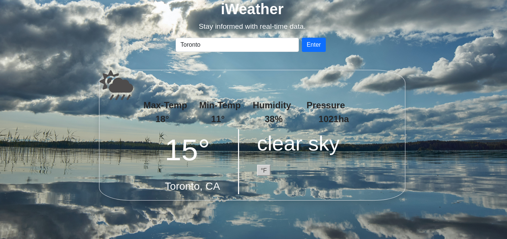

# iWeather
- A weather outlook web application that fetches real-time data from an API and makes same available to users. Developed with Javascript.

- The application uses the openWeather API to retrieve real-time data to display to users.



## Built With
- Javascript.
- HTML.
- CSS


## Getting Started

To get a local copy up and running, follow these simple steps.

- Go to the "Code" section of this repository and press the green button that says "Code". Copy the URL or the SSH key.
- Go to the terminal and enter:
```
git clone URL/SSH key
```

The URL or SSH are the links copied from the step above.

- If you don't have git installed, you can download this project and unzip it.
- Change directory into the folder the application is saved.
- Launch the application from index.html.

## Usage
- Enter the name of any city in the search bar and click "Enter".
- Wait for the browser to load the API call and update the page.


## Author


👤 **George Gbenle**

- GitHub: [george-shammar](https://github.com/george-shammar)
- Twitter: [@GeorgeShammar](https://twitter.com/GeorgeShammar)
- LinkedIn: [George Gbenle](https://www.linkedin.com/in/georgegbenle/)


## 🤝 Contributing

Contributions, issues and feature requests are welcome!


## Show your support

Give a ⭐️ if you like this project!


## 📝 License

This project is [MIT](LICENSE) licensed.

## Acknowledgments
- openWeather 